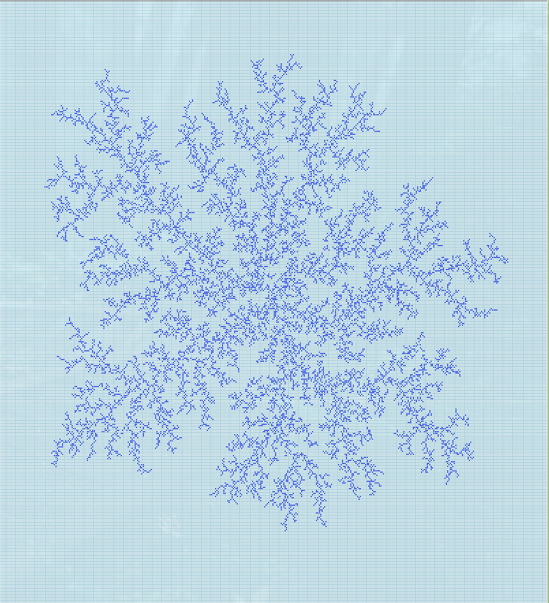

# DLA

## Examples
* `./2d_DLA.py -r 400 -c 400 -p 5000 -o outfile` to simulate 5000 particle DLA on a 400x400 grid, and store the output in `outfile`
* `./2d_DLA.py -r 400 -c 400 -p 1000 -g grids/dla_5000p_400r_400c -o grids/dla_6000p_400r_400c` to simulate 1000 particle DLA on top of the existing grid `grids/dla_5000p_400r_400c` and store it in a new file `grids/dla_6000p_400r_400c`. Note that the row and column arguments should match the
    dimensions of the grid you're growing.
* `./2d_DLA.py -f [filename]` to display a grid contained in the file `filename`. Add row/column parameters if the file contains a grid of nonstandard (100x100) size. Otherwise it won't display correctly (I'm going to add the ability to infer grid size from the file eventually).
* The following is the result of displaying the file `grids/dla_15000p_400r_400c`:

